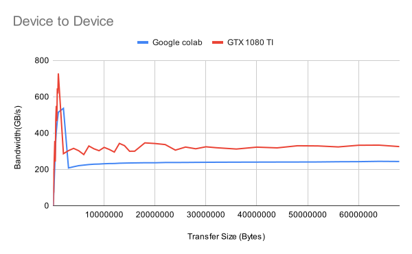
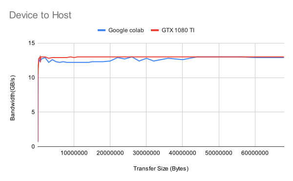
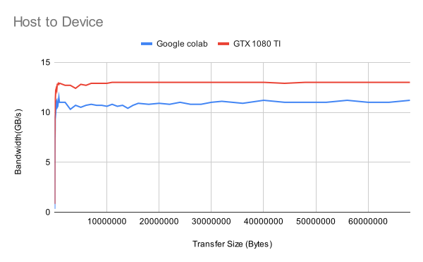

# Assignment 1

##### Felix Söderman DD2360 HT23

## Exercise 2
When looking in google colab I realized that the “samples” folder was not present in the default cuda SDK folder. I therefore cloned the following git repository (https://github.com/NVIDIA/cuda-samples) inside the Google colab instance and from there copied the code example required.

        !rm -rf cuda-samples/
        !rm -rf ./bandwidthTest
        !rm -rf ./cuda-help

        !git clone https://github.com/NVIDIA/cuda-samples.git
        !cp -rf ./cuda-samples/Samples/1_Utilities/bandwidthTest/ ./bandwidthTest
        !cp -rf ./cuda-samples/Common/ ./cuda-help
        !rm -rf cuda-samples/

To compile and run the code the following was done:

        !nvcc -I./cuda-help bandwidthTest/bandwidthTest.cu -o bandwidthTest/bandwidthTest
        !./bandwidthTest/bandwidthTest
        !./bandwidthTest/bandwidthTest --mode=shmoo

When plotting the values after running the bandwidthTest in shmoo mode, I was able to acquire the following data. I ran the program once on Google colab and once on my gaming PC that is equipped with a GTX 1080 TI. 

We see that the Device to Device speed is far faster than the other speeds, which indicates that it is not slowed down by the PCI-E bus. My GTX 1080 TI is running in a PCI-E 3.0 x 16b slot. Which allows the theoretical max speed over the buss to be 16 GB/s. Which is close to what is seen in the graph. Whilst the device to device speed is not limited by the PCI-E speed, much higher speeds are achieved. The Device to device also archives very high throughput when the transfer size is small. This is most likely because the data is small enough to fit inside the cache of the GPU. Whilst the bigger data is restricted by the buss between the GPU and GDRAM. The speed of the memory bus for the two cards are 320GB/s for the T4 card on Google colab [1] and a bit over 484.44 GB/s on the GTX 1080 TI[2].

## References

[1] “NVIDIA GeForce GTX 1080 Ti GPU specifications” https://www.gpuzoo.com/GPU-NVIDIA/GeForce_GTX_1080_Ti.html

[2] “NVIDIA T4” https://www.nvidia.com/en-us/data-center/tesla-t4/