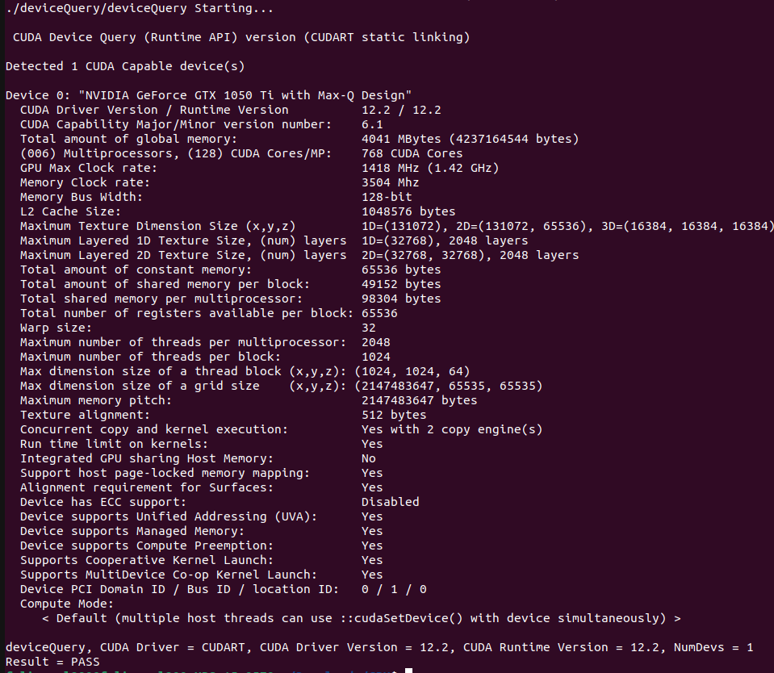
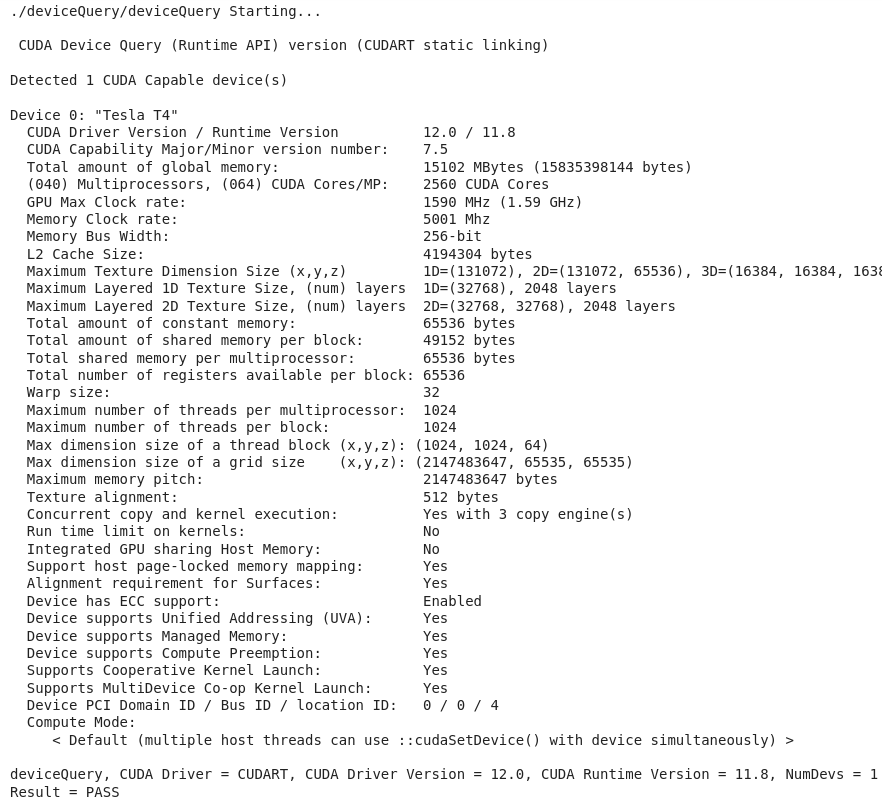

# Assignment 2

Felix Söderman DD2360 HT23\
Github: https://github.com/felixcool200/DD2360HT23

## Exercise 1 - Reflection on GPU-accelerated Computing
1. List the main differences between GPUs and CPUs in terms of architecture.

    **ANSWER:** The main differance between the two is that CPUs are based on Latency oriented processor architecture. This means that it is designed to minimize the time it takes to complete a single task. This results in a few cores that have high clock speed (and high energy usage). A CPU is thus good at solving single threaded tasks fast, such as sorting elements in a list.
  
    GPUs on the other hand use a throughput-oriented processor architecture. This means it is designed to maximize the amount of problems it can solve rather than making sure they are completed as soon as they are created. GPUs thus have many cores and is good at completling task that are parallelizable, such as AI workloads or processing individual pixels on a screen.

1. Check the latest Top500 list that ranks the top 500 most powerful supercomputers in the world. In the top 10, how many supercomputers use GPUs Report the name of the supercomputers and their GPU vendor (Nvidia, AMD, ...) and model.

    **ANSWER:**
    Since the definition of GPU is quite vauge. I will also include computers that run other type of accelerator cards that have similar capabilites.

    1	Frontier - HPE Cray EX235a, **AMD** Instinct MI250X

    <!-- 2 Supercomputer Fugaku - Supercomputer Fugaku, A64FX 48C 2.2GHz -->

    3	LUMI - HPE Cray EX235a, **AMD** Instinct MI250X

    4	Leonardo - BullSequana XH2000, **NVIDIA** A100 SXM4 64 GB
    
    5	Summit - IBM Power System AC922, **NVIDIA** Volta GV100

    6	Sierra - IBM Power System AC922, **NVIDIA** Volta GV100

    <!-- 7	Sunway TaihuLight - Sunway MPP, **Sunway** SW26010 260C 1.45GHz -->

    8	Perlmutter - HPE Cray EX235n, **NVIDIA** A100 SXM4 40 GB

    9	Selene - NVIDIA DGX A100, **NVIDIA** A100

    10 Tianhe-2A - TH-IVB-FEP Cluster, Intel Xeon E5-2692v2 12C 2.2GHz, **National University of Defense Technology (NUDT)** Matrix-2000
    NOTE that this last one is not a GPU per say but an accelerator card.

1. One main advantage of GPU is its power efficiency, which can be quantified by Performance/Power, e.g., throughput as in FLOPS per watt power consumption. Calculate the power efficiency for the top 10 supercomputers. (Hint: use the table in the first lecture)

    **ANSWER:**
    One can clearly see that the machines running GPUs are much more power efficient than those who does not.

    1	Frontier - RMax = 1194 [PFlop/s], Power = 22703 [kW] => Power efficiency = 52.59 [Gflop/watts]

    2 Supercomputer Fugaku - RMax = 442.01 [PFlops/s], Power = 29,899.23 kW [kW]  => Power efficiency = 14.78 [Gflop/watts]

    3	LUMI - RMax = 309.10 [PFlop], Power = 6015.77 [kW] => Power efficiency = 51.38 [Gflop/watts]

    4	Leonardo - RMax = 238.70 [PFlop], Power = 7404.40 [kW] => Power efficiency = 32.24 [Gflop/watts]
    
    5	Summit - RMax = 148.60 [PFlop], Power = 10096.00 [kW] => Power efficiency = 14.72 [Gflop/watts]

    6	Sierra - RMax = 94.64 [PFlop], Power = 7438.28 [kW] => Power efficiency = 12.72 [Gflop/watts]

    7	Sunway TaihuLight - RMax = 93.01 [PFlop], Power = 15371 [kW] => Power efficiency = 6.05 [Gflop/watts]

    8	Perlmutter - RMax = 70.87 [PFlop], Power = 2589 [kW] => Power efficiency = 27.37 [Gflop/watts]

    9	Selene - RMax = 63.46 [PFlop], Power = 2646 [kW] => Power efficiency = 23.98 [Gflop/watts]

    10 Tianhe-2A - RMax = 61.44 [PFlop], Power = 18482 [kW] => Power efficiency = 3.32 [Gflop/watts]

## Exercise 2 - Device Query
1. The screenshot of the output from you running deviceQuery test.

    Screenshot from running Device Query on my laptop
    
    Screenshot from running Device Query on Google Colab
    

2. What architectural specifications do you find interesting and critical for performance? Please provide a brief description.

    **ANSWER:**
    When looking at the specification I find that the:

    GPU Max clock rate, amount of cores and streaming multiprocessors are important since they determain how fast each core computes and how many cores can work at the same time.

    Memory clock rate, global memory size are also important since loading in assets from the CPU is much slower than from GDRAM. The cache size can also improve performace since it is even faster than GDRAM.
  
    These are the most relevant and critical features for perfomance.

3. How do you calculate the GPU memory bandwidth (in GB/s) using the output from deviceQuery? (Hint: memory bandwidth is typically determined by clock rate and bus width, and check what double date rate (DDR) may impact the bandwidth)

    **ANSWER:**
    To calculate the memory bus speed GB/s.
    First translate the memory buss width from bits to Bytes by dividing it by 8.Then take the Memory Clock rate and double it to to get the double data rate(DDR). After that take the new bus width [B] divided by the new memory clock lock speed [Hz] which then equals [B\*Hz] = [B\*(1/s)] = [B/s]. Lastly divide it 10^9 to make it [GB/s].

    Thus in my case:

        Bus Width:
        128 bit/8 = 16 Bytes.

        Clock Rate:
        3504 MHz*2 = 7008 MHz.

        Memory bus speed = (16 * (7008 * 10^6)) / 10^9 = 112.128 GB/s.

4. Compare your calculated GPU memory bandwidth with Nvidia published specification on that architecture. Are they consistent?

    **ANSWER:**
    When looking up the speed I get 112.1 GB/s which is identical to what was calculated.

## Exercise 3 - Compare GPU Architecture

1. List 3 main changes in architecture (e.g., L2 cache size, cores, memory, notable new hardware features, etc.)

    **ANSWER:**
    I decided to look at the consumer grade GPUs and there the three latest GPU arcitecture are Ada Lovelace (4000-series), Ampere (3000-series) and Turing (2000 -series). I decided to test the three best customer grade cards from each generation.

    | Card              | RTX 2080 Ti RTX | RTX 3090 Ti RTX | GeForce RTX 4090 |
    |-------------------|-----------------|-----------------|------------------|
    | L2 Cache (MB)     | 5.5 MB          | 6 MB            | 72 MB            |
    | Tensor Cores      | 544             | 336             | 512              |
    | SM Count          | 68              | 84              | 128              |
    | SP Count (Per SM) | 64              | 128             | 128              |
    | NVIDIA CUDA-cores | 4352            | 10752           | 16384            |
    | Boost clock (GHz) | 1.64 GHz        | 1.86 GHz        | 2.52 GHz         |
    | Base clock (GHz)  | 1.35 GHz        | 1.56 GHz        | 2.23 GHz         |
    | Bus Interface     | PCIe 3.0 x16    | PCIe 4.0 x16    | PCIe 4.0 x16     |
    | Global memory (GB)| 11 GB           | 24 GB           | 24 GB            |
    | Memory type       | GDDR6           | GDDR6X          | GDDR6X           |

2. List the number of SMs, the number of cores per SM, the clock frequency and calculate their theoretical peak throughput.

    **ANSWER:**
    Throughout is calulcated as ```SMs * SPs * Clock (GHz) * 1/1000 = Troughput (Tflops)```

    | Card                  | RTX 2080 Ti RTX | RTX 3090 Ti RTX | GeForce RTX 4090 |
    |-----------------------|-----------------|-----------------|------------------|
    | SM Count              | 68              | 84              | 128              |
    | SP Count (Per SM)     | 64              | 128             | 128              |
    | Boost clock (GHz)     | 1.64 GHz        | 1.86 GHz        | 2.52 GHz         |
    | Max Troughput (Tflops)| 7.14            | 20.00           | 41.29            |


3. Compare (1) and (2) with the NVIDIA GPU that you are using for the course. 

    **ANSWER:**
    I run three different GPUs in the course (1080 ti, 1050 ti Max-Q and Google colab (T4)). I will compare them with a GTX 1080 Ti

    | Card                  | RTX 1080 Ti RTX |
    |-----------------------|-----------------|
    | L2 Cache (MB)         | 2.75 MB         |
    | Tensor Cores          | 0               |
    | SM Count              | 28              |
    | SP Count (Per SM)     | 128             |
    | NVIDIA CUDA-cores     | 3584            |
    | Boost clock (GHz)     | 1.58 GHz        |
    | Base clock (GHz)      | 1.428 GHz       |
    | Bus Interface         | PCIe 3.0 x16    |
    | Global memory (GB)    | 11 GB           |
    | Memory type           | GDDR5X          |
    | Max Troughput (Tflops)| 5.66            |

## Exercise 4 - Rodinia CUDA benchmarks and Profiling

1. Compile both OMP and CUDA versions of your selected benchmarks. Do you need to make any changes in Makefile?

    **ANSWER:**
    When running the CUDA version of particalfilter the compute capability had to be changed to match my GPU by changing ```sm_13``` to ```sm_61``` on line 12 and line 15 in the makefile.

    When running lavaMD no changes was needed.

    When running hotspot3D the first line in the makefile as incorrect and neededto be changed from

    ``` include ~/rodinia_3.0/common/make.config``` \
    to\
    ``` include ../../common/make.config ```
2. Ensure the same input problem is used for OMP and CUDA versions. Report and compare their execution time. 

    **ANSWER:**
    ### Running particalfilter
    #### OpenMP

        make clean
        make openmp
        
        cat run
        ./particle_filter -x 128 -y 128 -z 10 -np 100000

    ##### RESULTS:

        ./run
        ENTIRE PROGRAM TOOK 5.897769

    #### CUDA

        make clean
        make all

        cat run
        ./particlefilter_naive -x 128 -y 128 -z 10 -np 100000

    ##### RESULTS:

        ./run
        ENTIRE PROGRAM TOOK 1.680555

    ### Running lavaMD
    #### OpenMP
        make clean

        cat run
        ./lavaMD -cores 12 -boxes1d 35

    ##### RESULTS:

        ./run
        Configuration used: cores = 12, boxes1d = 35
        Time spent in different stages of CPU/MCPU KERNEL:
        0.000000000000 s,  0.000000000000 % : CPU/MCPU: VARIABLES
        0.000006000000 s,  0.000024581621 % : MCPU: SET DEVICE
        0.000000000000 s,  0.000000000000 % : CPU/MCPU: INPUTS
        24.408475875854 s, 99.999984741211 % : CPU/MCPU: KERNEL
        Total time:
        24.408479690552 s

    #### CUDA

          make clean

          cat run
          ./lavaMD -boxes1d 35
      
      ##### RESULTS:

          ./run
          thread block size of kernel = 128
          Configuration used: boxes1d = 35
          Time spent in different stages of GPU_CUDA KERNEL:
          0.064755000174 s,  0.542295157909 % : GPU: SET DEVICE / DRIVER INIT
          0.000539999979 s,  0.004522267263 % : GPU MEM: ALO
          0.034356001765 s,  0.287716686726 % : GPU MEM: COPY IN
          11.818737983704 s, 98.976829528809 % : GPU: KERNEL
          0.014343000017 s,  0.120116434991 % : GPU MEM: COPY OUT
          0.008182000369 s,  0.068520717323 % : GPU MEM: FRE
          Total time:
          11.940914154053 s

    ### Running hotspot3D
    #### OpenMP:
          make clean
          make 3D

          cat run
          ./3D 512 8 10000 ../../data/hotspot3D/power_512x8 ../../data/hotspot3D/temp_512x8 output.out

          ./run

    ##### RESULTS:

        12 threads running
        Time: 38.112 (s)
        Accuracy: 4.856862e-05

    #### CUDA

          make clean
          make release
          
          cat run
          ./3D 512 8 10000 ../../data/hotspot3D/power_512x8 ../../data/hotspot3D/temp_512x8 output.out
          
          ./run

    ##### RESULTS:

          Time: 9.737 (s)
          Accuracy: 4.096975e-05

    
3. Do you observe expected speedup on GPU compared to CPU? Why or Why not?
    **ANSWER:**
    Over all the three workloads the CUDA version ran faster. This is most likley since all the workload were easily parallelizable. When running the programs with fewer iterations/smaller values (for example amount of particles in the particlefilter) the CPU and GPU had comparable speeds but when incresing the amount of particles in parallel the CUDA program ran much faster.

## (Bonus) Exercise 5 - GPU Architecture Limitations and New Development

  **ANSWER:**
  I decided to read "Buddy compression: Enabling larger memory for deep learning and HPC workloads on GPUs" [1]:

1. What limitations this paper proposes to address?

    **ANSWER:**
    <!--This paper tries to address the problem of (relativly) low high speed memory on GPUs. Which can limits the GPU core to be fully utilized if each thread needs to read much data from the global memory.-->

    The paper proposes to address the limitation of limited GPU memory capacity for high-throughput applications. Which can increse the utilization of the GPU cores.

2. What workloads/applications does it target?

    **ANSWER:**
    <!--The paper targets deep learning and HPC workloads since they are sterotypical workloads that have high memory usage, but any workload which requires much data to be read is applicable.-->

    Buddy Compression targets high-throughput applications like HPC and deep learning workloads that require large memory capacity.

3. What new architectural changes does it propose? Why it can address the targeted limitation?

    **ANSWER:**
    <!--They propose of this paper is to evaluate and check what memory compression algorithms would work as a memory-expansion alternative. And to be used as a slower-but-larger buddy memory connected thorugh a high-bandwidth interconnect, such as NVLink.-->

    Buddy Compression proposes a new architectural change that enables memory expansion by compressing memory entries and storing them in a separate buddy memory connected through a high-bandwidth interconnect, such as NVLink. This approach can address the targeted limitation by effectively increasing memory capacity without requiring additional hardware or significant changes to the existing system.

4. What applications are evaluated and how did they setup the evolution environment (e.g., simulators, real hardware, etc)?

    **ANSWER:**
    The paper evaluates 16 different HPC/Deep learning benchmarks that where tested using multiple algortims. They mostly used simulators but also real hardware, an example is that they compared Unifed memory and buddy compression on real hardware. The evaluation environment is set up using NVIDIA GPUs and the CUDA programming model.

5. Do you have any doubts or comments on their proposed solutions?

    **ANSWER:**
    <!--I myself does not any any doubts, but I am sceptical to how much of an improvment this will be. As it seems to add a lot of complexity whist giving a quite small gain.--> 

    I do not have any doubts or comments on their proposed solutions. However, it is important to note that the effectiveness of Buddy Compression may vary depending on the specific workload and system configuration. Thus one should keep in mind that it adds a lot of complexity may only result in immeasurable gains.

## References

[1] Choukse, E., Sullivan, M. B., O’Connor, M., Erez, M., Pool, J., Nellans, D., & Keckler, S. W. (2020, May). Buddy compression: Enabling larger memory for deep learning and HPC workloads on GPUs. In 2020 ACM/IEEE 47th Annual International Symposium on Computer Architecture (ISCA) (pp. 926-939). IEEE.


<!--
1. The paper proposes to address the limitation of limited GPU memory capacity for high-throughput applications like HPC and deep learning workloads.
2. Buddy Compression targets high-throughput applications like HPC and deep learning workloads that require large memory capacity.
3. Buddy Compression proposes a new architectural change that enables memory expansion by compressing memory entries and storing them in a separate buddy memory. This approach can address the targeted limitation by effectively increasing memory capacity without requiring additional hardware or significant changes to the existing system.
4. The paper evaluates several applications, including deep learning training workloads and HPC simulations, using both simulators and real hardware. The evaluation environment is set up using NVIDIA GPUs and the CUDA programming model.
5. As an expert on the content of the PDF, I do not have any doubts or comments on their proposed solutions. However, it is important to note that the effectiveness of Buddy Compression may vary depending on the specific workload and system configuration.

-->