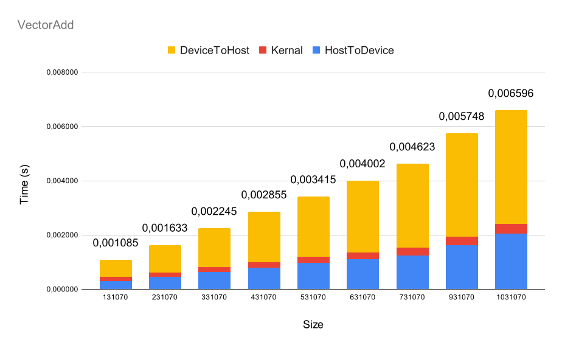
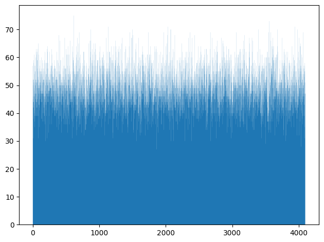
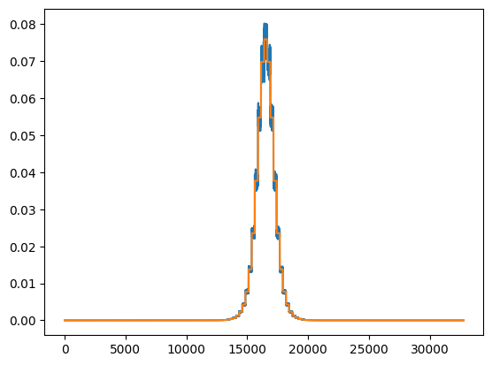
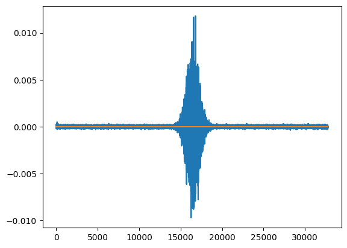

# Assignment 3
Github:[https://github.com/felixcool200/DD2360HT23](https://github.com/felixcool200/DD2360HT23)

##### Felix Söderman DD2360 HT23
## Exercise 1 - Your first CUDA program and GPU performance metrics

1. Explain how the program is compiled and run.

    I have a make file in the code repo (I used nvcc)

2. For a vector length of N:

    1. How many floating operations are being performed in your vector add kernel? 
        
        When adding a two vectors of length N there are N plus floating point operations that are performed.

    2. How many global memory reads are being performed by your kernel? 
        
        Since both vectors are read once for each addition there is a total of 2N globalreads from global memory.

3. For a vector length of 1024:
    1. Explain how many CUDA threads and thread blocks you used. 

        I used (1024+32-1)/32 = 32 thread blocks.
        and I used 32*32=1024 CUDA threads.
        

    2. Profile your program with Nvidia Nsight. What Achieved Occupancy did you get? You might find https://docs.nvidia.com/nsight-compute/NsightComputeCli/index.html#nvprof-metric-comparisonLinks. useful.

        I got Achieved Occupancy of 3.12% and a Theoretical Occupancy of 50%.

        When incresing the threads per block from 32 to 64 the Theoretical Occupancy increesed to 100% and the Achieved Occupancy to 6.19%


4. Now increase the vector length to 131070:

    1. Did your program still work? If not, what changes did you make?

        The program still works. No changes needed to be made.

    2. Explain how many CUDA threads and thread blocks you used.

        I used (131070+32-1)/32 = 4096 thread blocks.
        and I used 4096*32 = 131072 CUDA threads.

    3. Profile your program with Nvidia Nsight. What Achieved Occupancy do you get now?

        Achieved Occupancy is now 32.57% (at TPB at 32) and 74.35% (at TPB at 64)


5. Further increase the vector length (try 6-10 different vector length), plot a stacked bar chart showing the breakdown of time including (1) data copy from host to device (2) the CUDA kernel (3) data copy from device to host. For this, you will need to add simple CPU timers to your code regions.

    


## Exercise 2 - Your first CUDA program and GPU performance metrics

1. Name three applications domains of matrix multiplication.

    One application is machine learning matrix multiplication is the base of training a model. This is why, tensor cores are developed esecially to calculate matrix multiplications.

    Another application is solving linear equation systems. That is essential is engineering as many systems can be modeled as a linear combination of variables.

    Lastly in game programming matrix multiplication can be used to rotate objects in 3d space (using rotation matrices).

2.  How many floating operations are being performed in your matrix multiply kernel? 

    I have written three different implementation of my kernal. The one using atomicAdd runs 2 floating point operation (per thread), one for multiplying the values and one for atomicadd to the C vector.

    While the second runs first a two floating point operation (similar to the last one, but add to shared variable instead of atomicAdd), but if it is threadIdx.x = 0 it also does numAColumns additional floating point operations when taking the sum over the shared variable. 

    Lastly my last kernal always runs numAColumns floating point operations (per thread).

    When talking about an entire run we multiply the number from the previous question with how many threads are created. Which is equal to the amount of numCRows * numCColumns for the first and third kernal implementation but for the second one there is numCRows * numCColumns * numAColumns since it runs all calculations in paralell. 

    (I added a table at the end of question 3 to show all values)


3. How many global memory reads are being performed by your kernel?

    All three versions of my kernals only read the global memory twice.

    | Kernal                                                                                                     	| gemmShared                                                  	| gemmAtomicAdd                            	| gemmBIG                                  	|
    |------------------------------------------------------------------------------------------------------------	|-------------------------------------------------------------	|------------------------------------------	|------------------------------------------	|
    | Number of threads (excluding CUDA threads that do no global memory reads and no floating point operations) 	| numCColumns * numCRows * numAColumns                        	| numCColumns * numCRows * numAColumns     	| numCColumns * numCRows                   	|
    | Number of floating point operations (per thread)                                                           	| 2 or 2+numAColumns                                          	| 2                                        	| 2*numAColumns                            	|
    | Global memory reads (per thread)                                                                           	| 2                                                           	| 2                                        	| 2*numAColumns                            	|
    | Number of floating point operations (total)                                                                	| (2 or 2+numAColumns) * numCColumns * numCRows * numAColumns 	| 2 * numCColumns * numCRows * numAColumns 	| 2 * numAColumns * numCColumns * numCRows 	|
    | Global memory reads (total)                                                                                	| 2 * numCColumns * numCRows * numAColumns                    	| 2 * numCColumns * numCRows * numAColumns 	| 2 * numAColumns * numCColumns * numCRows     	|

4. For a matrix A of (128x128) and B of (128x128):
        
    1. Explain how many CUDA threads and thread blocks you used.

        For the first and second kernal implementation there is numCRows * numCColumns * numAColumns which results in 128^3 = 2097152 CUDA threads

        For the third kernal implementation there are numCRows * numCColumns kernals which means that in this case it is 128^2 = 16384 CUDA threads.
        
    2. Profile your program with Nvidia Nsight. What Achieved Occupancy did you get? 

    | Kernal                 	| gemmShared 	| gemmAtomicAdd 	| gemmBIG 	|
    |------------------------	|------------	|---------------	|---------	|
    | Cuda threads           	| 2097152      	| 2097152       	| 16384   	|
    | Achieved occupancy (%) 	| 88.35      	| 88.55         	| 98.15   	|

5. For a matrix A of (511x1023) and B of (1023x4094):
    
    1. Did your program still work? If not, what changes did you make?
        This workes for all three of my kernal versions (first and second kernal does not allow for 1023 to go above 1024, since that would need more than 1024 threads per block which is not possible).

    2. Explain how many CUDA threads and thread blocks you used.

        For the first and second kernal implementation there is numCRows * numCColumns * numAColumns which results in 511 * 4094 * 1023  = 2140150782 CUDA threads

        For the third kernal implementation there are numCRows * numCColumns kernals which means that in this case it is 511 * 4094 = 2092034 CUDA threads.

    3. Profile your program with Nvidia Nsight. What Achieved Occupancy do you get now?

        | Kernal                 	| gemmShared 	| gemmAtomicAdd 	| gemmBIG 	|
        |------------------------	|------------	|---------------	|---------	|
        | Cuda threads           	| 2140150782 	| 2140150782    	| 2092034 	|
        | Achieved occupancy (%) 	| 16.33      	| 74.01         	| 98.64   	|

6. Further increase the size of matrix A and B, plot a stacked bar chart showing the breakdown of time including (1) data copy from host to device (2) the CUDA kernel (3) data copy from device to host. For this, you will need to add simple CPU timers to your code regions. Explain what you observe.
    In the plot one can see that the kernal time is by far the biggest contributing factor to the total time spent running the program. One can also see that the kernal called gemmBIG is the fastest. I assume this is becuase it has a order of magnitude less kernals (but each kernal does more work). This indicates that the overhead of creating kernals is substantial compared to the work done in gemmShared and gemmAtomicAdd.

    
    
    


7. Now, change DataType from double to float, re-plot the a stacked bar chart showing the time breakdown. Explain what you observe. 

    Firstly I had to decrese the max random number from 10000 to 100 and increse the tolerane from 0.004 to 1. This is because otherwise the float was not able to store the result to high enough precision.


    
    
    


## Exercise 3 - Histogram and Atomics

1. Describe all optimizations you tried regardless of whether you committed to them or abandoned them and whether they improved or hurt performance.

    my first implementation looked like this:
    Here I already done som optimizations. Such as removing num_bins as a parameter since it is a compile time constant.

    ``` cpp 
    __global__ void histogram_kernel(unsigned int *input, unsigned int *bins, unsigned int num_elements){

        __shared__ unsigned int temp_bins[NUM_BINS];
        int index = blockIdx.x * blockDim.x + threadIdx.x;
            if(threadIdx.x == 0){
                for(int i = 0; i < NUM_BINS;++i){
                    temp_bins[i] = 0;
                }
            }
            __syncthreads();

            if (index < num_elements){
                atomicAdd(&temp_bins[input[index]],1);
            }

            __syncthreads();
            if(threadIdx.x == 0){
                for(int i = 0; i < NUM_BINS; ++i){
                    atomicAdd(&(bins[i]),temp_bins[i]);
                }
            }

    }
    ```
    this had a kernal run time of: 0.001512 s (with input set to 1 000 000)

    I then tried to paralize the creation of the shared variable

    ```cpp
    __global__ void histogram_kernel(unsigned int *input, unsigned int *bins, unsigned int num_elements){

        __shared__ unsigned int temp_bins[NUM_BINS];
        int index = blockIdx.x * blockDim.x + threadIdx.x;
        for(int i = 0; i < NUM_BINS/TPB;++i){
            temp_bins[i*TPB+threadIdx.x] = 0;
        }
        __syncthreads();

        if (index < num_elements){

            atomicAdd(&temp_bins[input[index]],1);
        }

        __syncthreads();

        if(threadIdx.x == 0){
            for(int i = 0; i < NUM_BINS; ++i){
                unsigned int tmp = temp_bins[i];
                if(tmp != 0){
                    atomicAdd(&(bins[i]),tmp);
                }
            }
        }
    }
    ```


    this had a kernal run time of: 0.005442 s (with input set to 1 000 000).

    Then I tried to instead parallelize the adding the temporary shared variable to the global variable.


    ``` cpp 
    __global__ void histogram_kernel(unsigned int *input, unsigned int *bins, unsigned int num_elements){

        __shared__ unsigned int temp_bins[NUM_BINS];
        int index = blockIdx.x * blockDim.x + threadIdx.x;
        if(threadIdx.x == 0){
            for(int i = 0; i < NUM_BINS;++i){
                temp_bins[i] = 0;
            }
        }
        __syncthreads();

        if (index < num_elements){
            atomicAdd(&temp_bins[input[index]],1);
        }
         __syncthreads();

        for(int i = 0; i < NUM_BINS/TPB;++i){
            if(temp_bins[TPB * i + threadIdx.x] != 0){
                atomicAdd(&(bins[TPB * i + threadIdx.x]),temp_bins[TPB * i + threadIdx.x]);
            }
        }
    }
    ```
    this had a kernal run time of: 0.000394 s (with input set to 1 000 000).
    
    I then tried to combine the last two attempts and it resulted in the fastest kernal I was able to create.
    ```cpp
    __global__ void histogram_kernel(unsigned int *input, unsigned int *bins, unsigned int num_elements){

        __shared__ unsigned int temp_bins[NUM_BINS];
        int index = blockIdx.x * blockDim.x + threadIdx.x;
        
        for(int i = 0; i < NUM_BINS/TPB;++i){
            temp_bins[i*TPB+threadIdx.x] = 0;
        }
        __syncthreads();

        if (index < num_elements){
            atomicAdd(&temp_bins[input[index]],1);
        }
        __syncthreads();

        for(int i = 0; i < NUM_BINS/TPB;++i){
            if(temp_bins[TPB * i + threadIdx.x] != 0){
                atomicAdd(&(bins[TPB * i + threadIdx.x]),temp_bins[TPB * i + threadIdx.x]);
            }
        }
    }
    ```
    this had a kernal run time of: 0.000170 s (with input set to 1 000 000). (This time is similar to how fast it takes to launch the cpu timer thus it is very hard to see any further improvments).

    
    Lastly I tried to remove the if statment around the atomic add (to simply add the zeros aswell)

    ```cpp
    __global__ void histogram_kernel(unsigned int *input, unsigned int *bins, unsigned int num_elements){

        __shared__ unsigned int temp_bins[NUM_BINS];
        int index = blockIdx.x * blockDim.x + threadIdx.x;
        
        for(int i = 0; i < NUM_BINS/TPB;++i){
            temp_bins[i*TPB+threadIdx.x] = 0;
        }
        __syncthreads();

        if (index < num_elements){
            atomicAdd(&temp_bins[input[index]],1);
        }
        __syncthreads();

        for(int i = 0; i < NUM_BINS/TPB;++i){
            atomicAdd(&(bins[TPB * i + threadIdx.x]),temp_bins[TPB * i + threadIdx.x]);
        }
    }
    ```
    This had a simiar time to the last sulotion so I decided to keep the if statment.

2. Which optimizations you chose in the end and why? 
    This is my final kernal. I applied both parralization to the setting the shared memory to zero and adding the shared variable to the global memory.
    ```cpp
    __global__ void histogram_kernel(unsigned int *input, unsigned int *bins, unsigned int num_elements){

        __shared__ unsigned int temp_bins[NUM_BINS];
        int index = blockIdx.x * blockDim.x + threadIdx.x;
        
        for(int i = 0; i < NUM_BINS/TPB;++i){
            temp_bins[i*TPB+threadIdx.x] = 0;
        }
        __syncthreads();

        if (index < num_elements){
            atomicAdd(&temp_bins[input[index]],1);
        }
        __syncthreads();

        for(int i = 0; i < NUM_BINS/TPB;++i){
            if(temp_bins[TPB * i + threadIdx.x] != 0){
                atomicAdd(&(bins[TPB * i + threadIdx.x]),temp_bins[TPB * i + threadIdx.x]);
            }
        }
    }
    ```
3. How many global memory reads are being performed by your kernel? Explain 
    
    Only a single global memory read is done (per thread), this is when temp_bin is indexed by input. All other reads are from the shared memory. (I create inputLength threads thus inputLength is the amount of total global memory reads.)

4. How many atomic operations are being performed by your kernel? Explain

    There are two atomicAdd operations per thread thus 2* inputLength in total.

5. How much shared memory is used in your code? Explain
    I create an unsiged int array of size 4096, Thus 4096\*8 = 32768 bytes are used per block. Since there is 1024 threads per block there is a always 4 blocks (4096/1024 = 4). Thus 32768\*4 = 131072 bytes are used in total.

6. How would the value distribution of the input array affect the contention among threads? For instance, what contentions would you expect if every element in the array has the same value? 

    If every element would need to be placed in a single bucket. All threads needs to write (atomicAdd) to the same shared memory location and thus have to wait for each other to not create corrupted memory or a datarace. This would remove most of the gains of parallizing the code in the first place since all threads in a block would have to wait for each other. It would still be in parallel across the 4 different blocks.

7. Plot a histogram generated by your code and specify your input length, thread block and grid.

    Histogram with input length of 200 000 with a 1024 threads per block and 4 total blocks.
    


8. For a input array of 1024 elements, profile with Nvidia Nsight and report Shared Memory Configuration Size and Achieved Occupancy. Did Nvsight report any potential performance issues?

    For histogram_kernel:

        Achieved Occupancy: 48.52%
        Shared Memory Configuration Size: 32.77 Kbyte.
    
    Nsight gave the following warnings

    "This kernel grid is too small to fill the available resources on this device, resulting in only 0.0 full waves across all SMs. Look at Launch Statistics for more details."

    and          

    "The grid for this launch is configured to execute only 2 blocks, which is less than the GPU's 40 multiprocessors. This can underutilize some multiprocessors. If you do not intend to execute this kernel concurrently with other workloads, consider reducing the block size to have at least one block per multiprocessor or increase the size of the grid to fully utilize the available hardware resources. See the Hardware Model (https://docs.nvidia.com/nsight-compute/ProfilingGuide/index.html#metrics-hw-model) description for more details on launch configurations."

    and 

    "This kernel's theoretical occupancy is not impacted by any block limit. The difference between calculated theoretical (100.0%) and measured achieved occupancy (48.5%) can be the result of warp scheduling overheads or workload imbalances during the kernel execution. Load imbalances can occur between warps within a block as well as across blocks of the same kernel. See the CUDA Best Practices Guide (https://docs.nvidia.com/cuda/cuda-c-best-practices-guide/index.html#occupancy) for more details on optimizing occupancy."

    for convert_kernel:

        Achieved Occupancy: 48.01%
        Shared Memory Configuration Size: 32.77 Kbyte.

    "This kernel grid is too small to fill the available resources on this device, resulting in only 0.1 full waves across all SMs. Look at Launch Statistics for more details. "

    and

    "The grid for this launch is configured to execute only 8 blocks, which is less than the GPU's 40 multiprocessors. This can underutilize some multiprocessors. If you do not intend to execute this kernel concurrently with other workloads, consider reducing the block size to have at least one block per multiprocessor or increase the size of the grid to fully utilize the available hardware resources. See the Hardware Model (https://docs.nvidia.com/nsight-compute/ProfilingGuide/index.html#metrics-hw-model) description for more details on launch configurations"

    and

    "This kernel's theoretical occupancy is not impacted by any block limit. The difference between calculated theoretical (100.0%) and measured achieved occupancy (48.0%) can be the result of warp scheduling overheads or workload imbalances during the kernel execution. Load imbalances can occur between warps within a block as well as across blocks of the same kernel. See the CUDA Best Practices Guide (https://docs.nvidia.com/cuda/cuda-c-best-practices-guide/index.html#occupancy) for more details on optimizing occupancy."


## Exercise 4 - A Particle Simulation Application
1. Describe the environment you used, what changes you made to the Makefile, and how you ran the simulation.

    I ran the code on google colab. The only change was to change the cuda compatability from 3.0 to 6.1. (ARCH=sm_30 to ARCH=sm_61 in Makefile).

    To run the simulation i ran the following commands on colab.
    
        !git clone https://github.com/KTH-HPC/sputniPIC-DD2360.git
        !cp /content/sputniPIC-DD2360/src/Particles.cu /content/ParticlesCPU.cu 

        !rm -rf /content/sputniPIC-DD2360/bin/data/
        !rm -rf /content/sputniPIC-DD2360/bin/data_GPU/
        !rm /content/sputniPIC-DD2360/src/Particles.cu

        # ==================== GPU ====================
        !cp /content/ParticlesGPU.cu /content/sputniPIC-DD2360/src/Particles.cu

        %cd /content/sputniPIC-DD2360/
        !make
        %cd /content/sputniPIC-DD2360/bin
        !mkdir -p data
        !./sputniPIC.out /content/sputniPIC-DD2360/inputfiles/GEM_2D.inp
        %cd /content

        !mv /content/sputniPIC-DD2360/bin/data/ /content/sputniPIC-DD2360/bin/data_GPU/

        # ==================== CPU ====================
        !rm /content/sputniPIC-DD2360/src/Particles.cu
        !cp /content/ParticlesCPU.cu /content/sputniPIC-DD2360/src/Particles.cu

        %cd /content/sputniPIC-DD2360/
        !make
        %cd /content/sputniPIC-DD2360/bin
        !mkdir -p data
        !./sputniPIC.out /content/sputniPIC-DD2360/inputfiles/GEM_2D.inp
        %cd /content
2. Describe your design of the GPU implementation of mover_PC() briefly. 

    I decided to parallelize the for loop responsable for each particle. The inner loops seem hard to parallelize since they depend on each other and are inherintly iterative.

    My implementation thus copies part, field, grd, param to the device, does all calulations and copies part back to be able to use the results.

3. Compare the output of both CPU and GPU implementation to guarantee that your GPU implementations produce correct answers.

    To compare the outputs I used the wrote a python script that compares the output files against each other (Since the results are float there is a epsilon that allows for small differences in the output). 


    ```python
    !diff /content/sputniPIC-DD2360/bin/data/B_10.vtk /content/sputniPIC-DD2360/bin/data_GPU/B_10.vtk
    !diff /content/sputniPIC-DD2360/bin/data/E_10.vtk /content/sputniPIC-DD2360/bin/data_GPU/E_10.vtk
    !diff /content/sputniPIC-DD2360/bin/data/sputniPICparameters.txt /content/sputniPIC-DD2360/bin/data_GPU/sputniPICparameters.txt


    files = ["rhoe_10.vtk","rho_net_10.vtk","rhoi_10.vtk"]
    EPSILON = 0.02

    def compare():
    for file in files:
        print("FILE:",file)
        GPU = open("/content/sputniPIC-DD2360/bin/data_GPU/" + file, "r").read().split()
        CPU = open("/content/sputniPIC-DD2360/bin/data/" + file, "r").read().split()
        if len(CPU) != len(GPU):
        print("Error diff length, not the same")
        return
        else:
        for i in range(len(GPU)):
            try:
            fGPU = float(GPU[i])
            fCPU = float(CPU[i])
            diff = abs(fGPU - fCPU)

            if(abs(fGPU - fCPU) >= EPSILON):
                print("Error to big diff")
                return
            except ValueError:
            if(GPU[i] != CPU[i]):
                print("Error not equal",GPU[i],CPU[i])
                return
    compare()
    ```

    The output differs which is most likley because the GPU seem to have more limited precision when it comes to floating point numbers.

    To make sure that they are close enough I also plotted the values:


    
    
    

    Here is the code to make the graphs.

    ```python
    import matplotlib
    import matplotlib.pyplot as plt

    files = ["rhoe_10.vtk","rho_net_10.vtk","rhoi_10.vtk"]

    figIndex = 0

    def plotsNStuff():
    global figIndex
    for file in files:
        data1 = []
        data2 = []
        print("FILE:",file)
        with open('/content/sputniPIC-DD2360/bin/data/'+file) as f:
            lines = f.readlines()
            for line in lines:
            try:
                data1.append(float(line))
            except:
                pass

        with open('/content/sputniPIC-DD2360/bin/data_GPU/'+file) as f:
            lines = f.readlines()
            for line in lines:
            try:
                data2.append(float(line))
            except:
                pass
        plt.figure(figIndex)
        figIndex += 1
        plt.plot(range(len(data1)), data1)

        #plt.figure(figIndex)
        figIndex += 1
        plt.plot(range(len(data2)), data2)

    plotsNStuff()
    plt.show()
    ```

4. Compare the execution time of your GPU implementation with its CPU version.

    CPU:
    **************************************
   Tot. Simulation Time (s) = 60.4837

   Mover Time / Cycle   (s) = 3.24923

   Interp. Time / Cycle (s) = 2.50258
    **************************************

    GPU:
    **************************************
   Tot. Simulation Time (s) = 28.7672

   Mover Time / Cycle   (s) = 0.0432936

   Interp. Time / Cycle (s) = 2.46405
    **************************************

    Here we see that the majority of the mover times has been removed. With the ten cycles we use here we can see that the total mover time went from 32.4s to 0.4s.
    
    The next step in improving the code would be to parallelize Interp since it is now the main part of the total simulation time 24s out of the 28s.