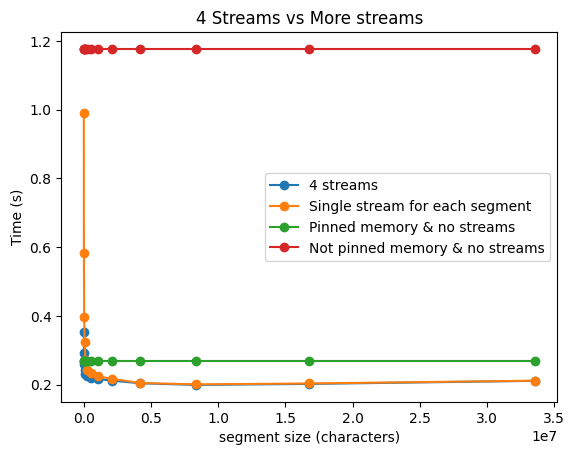
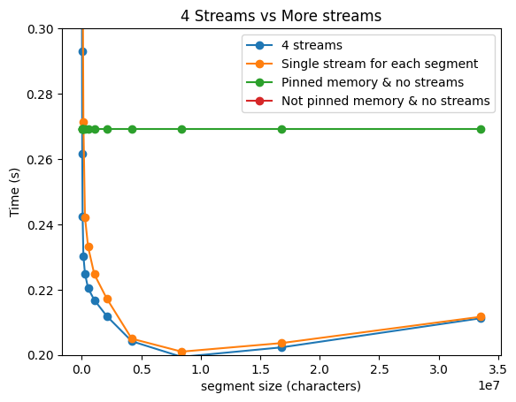
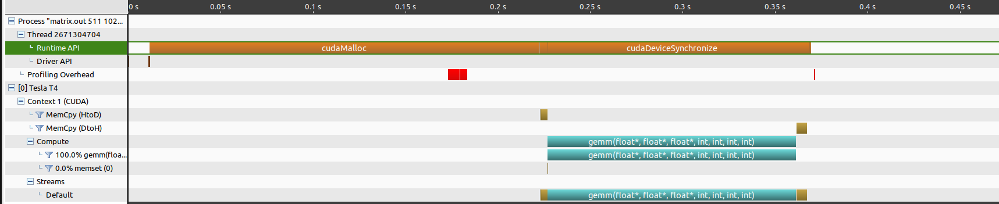
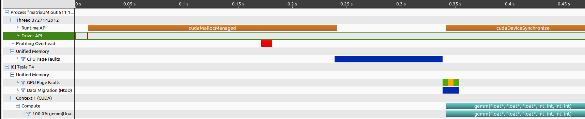

# Assignment 4

Felix Söderman DD2360 HT23\
Github: https://github.com/felixcool200/DD2360HT23

## Exercise 1 -  Thread Scheduling and Execution Efficiency 

1. Assume X=800 and Y=600. Assume that we decided to use a grid of 16X16 blocks. That is, each block is organized as a 2D 16X16 array of threads. How many warps will be generated during the execution of the kernel? How many warps will have control divergence? Please explain your answers.

    **ANSWER:**
    There are 800/16 = 50 blocks in X direction and 600/16 = 37.5 blocks in Y direction. Each warp is 32 threads this means that each block will have 8 warps. When flattening each block one can see that each warp takes two rows from the block. This means that threadId.y = 0 and 1 are the first warp and 2 and 3 are the next warp etc. The last row of 50 blocks are half of the block "outside" the range of what indecies enter the if statment. This means halv of the threads in the block will enter the if statment and the other halv wont. In this case this means that the first 8 lines (or 4 warps) of each block are going to enter the if statment and the last 4 warps are going to skip it. This means that there is no warp that has to both enter and skip the if statment. This means that we will not have any control divergence.

    8 warps \* 50 blocks X \* 37 blocks Y = 14800 warps.

    then there are 4 warps in the last block that enter the if statment and 4 that do not. This results in 2 \* 4 warps \* 50 blocks X = 400 warps.

    In total we have 14800 + 400 = 15200 warps and no warps have control divergence.

2. Now assume X=600 and Y=800 instead, how many warps will have control divergence? Please explain your answers.

    **ANSWER:**
    When flipping X and Y there the splitting of blocks into warps does not go as smoothly. The last column of 50 blocks halv of the each row is "outside" and thus does not run the if stament. Since the warp are still split acording to two rows per warp. All warps in the last column get control divergence. 

    8 warps \* 37 blocks X \* 50 blocks Y = 14800 warps.
    
    Since we have control divergance all blocks in the last column have to run twice. Once entering and once skipping the if statement. This results in 8 warps \* 50 blocks X = 400 warps that have control divergence.

    In total we have 14800 + 400 = 15200 warps and 400 warps has control divergence.

3. Now assume X=600 and Y=799, how many warps will have control divergence? Please explain your answers.

    **ANSWER:**
    In this case we get a similar setup to the last one but instead of them fitting perfectly in Y direction we get even more control divergence at the last row of blocks. This means that the entire last row that was working before now get control divergance. Thus 37 more blocks diverge (But ony the last warp in each block). (The last in the row already diverged on all 8 of its warps and thus does not generate any more control divergence). 

    8 warps \* 37 blocks X \* 50 blocks Y = 15200 warps.

    In total we have 15200 warps and 400 + 37 = 437 warps has control divergence.

## Exercise 2 - CUDA Streams
1. Compared to the non-streamed vector addition, what performance gain do you get? Present in a plot ( you may include comparison at different vector length)

    **ANSWER:**
    After adding pinned memory allocation to the old implementation (to make it a fair comparison). I was able to get the following results when changing the s_seg (and thus incresing the amount of streams).

    When I decided on locking the amount of streams to four and instead reuse the streams I get the following results.

    

2. Use nvprof to collect traces and the NVIDIA Visual Profiler (nvvp) to visualize the overlap of communication and computation.

    When running NVVP I was able to see that the streams did overlap correctly.

    

3. What is the impact of segment size on performance? Present in a plot ( you may choose a large vector and compare 4-8 different segment sizes)

    
    
    

## Exercise 3 - Pinned Memory and Unified Memory

### Using part 1

1. What are the differences between pageable memory and pinned memory, what are the tradeoffs?

    <!--    Pageable memory can be sent to disk (swap partition in linux) when there is no more room in memory while pinned memory can not. Pinned memory also speeds up cudaMemcpy since when coping pageable memory cuda has to make a pinned copy of the memory before it can start to copy the memory to the device, otherwise the memory could be paged out while cuda copies the memory which would result in corrupt memory. This means that pageable memory is most likley slower when working with cuda. One draw back to pinned memory is that if the RAM is full when trying to create the pinned the malloc will fail while pagable memory can always move somthing to disk to make space for it.-->

    The distinction between pageable memory and pinned memory lies in their behavior when system memory becomes exhausted. Pageable memory can be swapped to disk (usually to a swap partition in Linux) when there's no available memory, whereas pinned memory cannot. Additionally, pinned memory enhances the performance of cudaMemcpy because, when copying pageable memory, CUDA needs to create a pinned copy of the memory before initiating the transfer to the device. This step is necessary to prevent the memory from being paged out while CUDA is copying it, which otherwise could lead to data corruption. Consequently, pageable memory tends to be slower when working with CUDA.

    However, a drawback of pinned memory is that if the system's RAM is full when attempting to allocate pinned memory, the allocation will fail. In contrast, pageable memory can always resort to moving some data to disk to free up space for new allocations. Pinned memory is also much more expensive to allocate and deallocate than pageable memory.

2. Compare the profiling results between your original code and the new version using pinned memory. Do you see any difference in terms of the breakdown of execution time after changing to pinned memory?

    
    

    Much Much shorter cudaMalloc time.
    More time in cudaHostAlloc
    Memcpy H2D is twise as fast with pinned
    Memcpy D2H is much faster pinned 660 micro -> 5.5 ms
    (Check CPU times for alloc/hostAlloc??)

3. What is a managed memory? What are the implications of using managed memory?

    Managed memory or unified memory is a memory management concept that aims to simplify memory management for developers by automating certain aspects of memory allocation and deallocation. The main conecept is to allow both host (CPU) and device (GPU) to read and write to the same memory. This can sometimes be an actual shared memory or a virtaul memory that writes both to host and device memory. 

4. Compare the profiling results between your original code and the new version using managed memory. What do you observe in the profiling results?

    
    

## Exercise 4 - Heat Equation with using NVIDIA libraries

